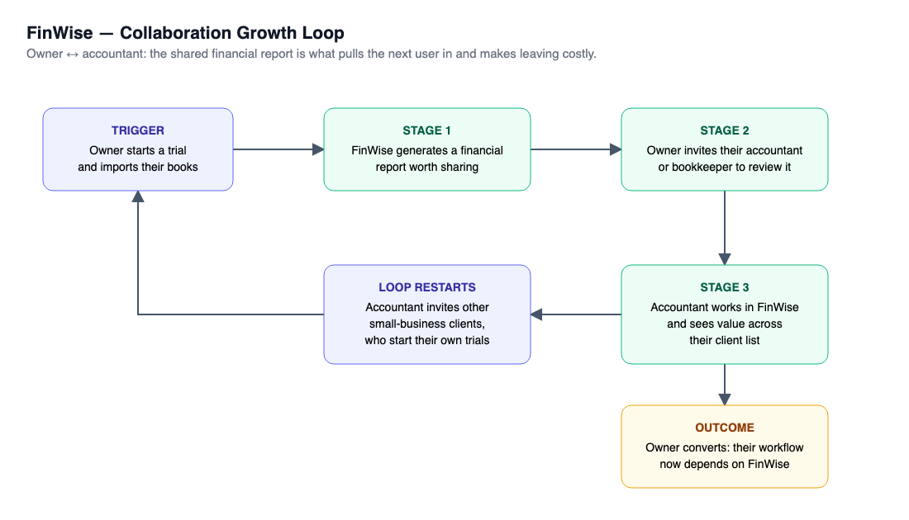

# The Bet · FinWise

> Module 1 · Ignite a PLG Motion. The growth hypothesis and where you're betting, plus the growth-loop visualization.

## Growth hypothesis

FinWise's biggest growth problem is that 98% of trials end without paying, and conversion holds at ~2% whatever happens to traffic or feature adoption, because a solo trial user can set FinWise up without ever producing a result another person depends on, so walking away at trial end costs them nothing.

_Working notes: I think FinWise's biggest problem is that people try the product and never see it do anything for their business. Ads are buying sign-ups for a product that isn't closing them. Evidence: (1) It's a reverse trial: people get the full product free and 98% still walk away, so they aren't blocked from the value, they just never reach it. (2) Six in ten paying customers leave within a year: the same problem, showing up later. (3) More ad money stopped working: if the leak were at the top, more money would help, so the leak is after sign-up. Against the data: The leak is where I thought: after sign-up. 98% of trials (6,296 of 6,424) never convert. But my bet was wrong: when the share of users importing data rose from ~31% to ~45%, conversion stayed flat. Getting data in isn't enough. Users need a result they act on, ideally one someone else relies on._

_____

## The bet

After data import, prompt trial users to invite their accountant or bookkeeper to review an auto-generated monthly financial report. A/B test on new trials. Primary metric: % of trials with an accepted accountant invite. Guardrail: data-import completion. Trial → paid tracked as the lagging outcome.

**Not doing:** Not raising paid acquisition or optimizing visit → trial: at a fixed 2% conversion, more trials just scale the leak. Not pushing feature adoption (import, modeling) as a goal by itself. Not running churn-only plays (win-back offers, annual-plan discounts) yet. Not building a referral-reward program before the Aha works.

_____

## Growth loop

**Loop type:** Collaboration, because small-business finance is already shared work between the owner and their accountant or bookkeeper. The loop turns that existing relationship into the reason to stay, and each accountant can bring in other clients at no ad cost

_____
