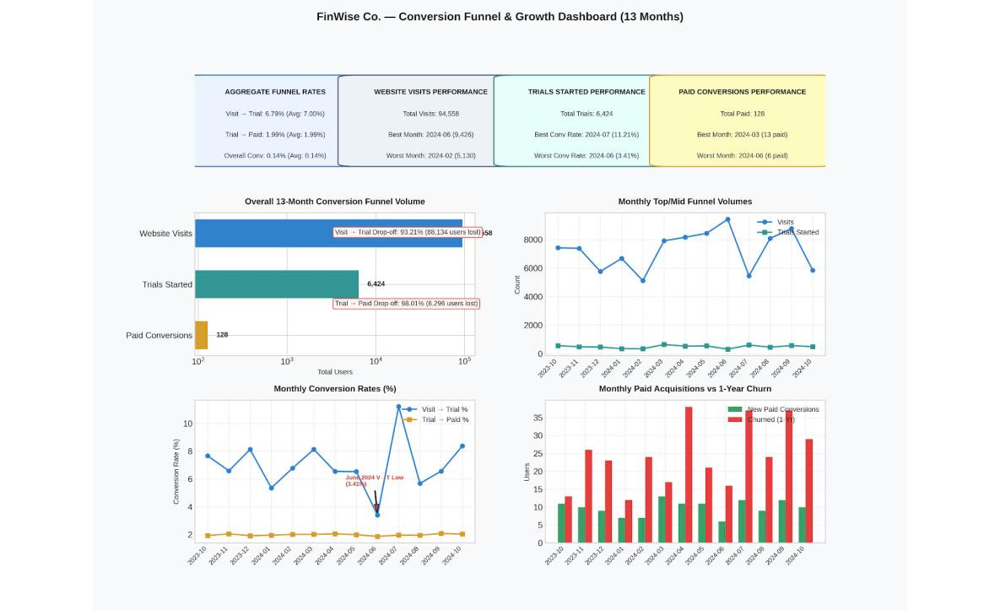
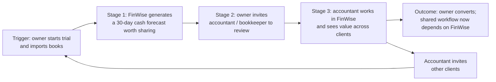

# The Bet · FinWise

> Module 1 · Ignite a PLG Motion. The growth hypothesis and where you're betting, plus the growth-loop visualization.

## Growth hypothesis

### Exercise 1 · My first hypothesis (scenario only, before the data)

**Your hypothesis.** I think FinWise's biggest problem is that people try the product and never see it do anything for their business. Ads are buying sign-ups for a product that isn't closing them.

**Your evidence.**
1. It's a reverse trial. People get the full product for free and 98% still walk away. They aren't blocked from the value. They just never reach it.
2. Six in ten paying customers leave within a year. Even the ones who pay aren't getting enough to stay. Same problem, showing up later.
3. More ad money stopped working. If the leak were at the top, more money would help. It doesn't, so the leak is after sign-up.

**Your bet.** Get people to connect their books on day one. I run small businesses. A finance tool shows me nothing until it has my real numbers in it.

**Testable hypothesis.**
- **IF** new trial users get a guided first session that connects their bank or accounting data on day one
- **THEN** trial → paid WILL increase from 2.0% to 2.5%
- **BECAUSE** a finance tool shows no value until it holds the user's own numbers
- **MEASURED WITH** an A/B test on new trials over 4 weeks of sign-ups; trial → paid as the primary metric, day-1 drop-off as the guardrail

### Exercise 2 · What the data showed

*Dashboard and patterns generated by Gemini from the course dataset and the lab's prompt.*

**The pattern that surprised me most, and why.** Trial → paid stays between 1.87% and 2.08% in every one of the 13 months. It doesn't move while visits, session length, data import (31–45%) and modeling (11–58%) all swing widely. I expected more users importing data to mean more users converting. It didn't.

**The biggest drop-off is at the Activation stage.** 98% of trials (6,296 of 6,424) never convert. The largest *absolute* loss is visit → trial (93% of visitors, an Acquisition problem). But ad money already buys plenty of trials, and they don't convert. The rate that matters is the 98%.

**Did the data confirm or challenge your hypothesis?** ↻ Challenged it.

**What the data told me.** The leak is where I thought: after sign-up. But my bet was wrong. When the share of users importing data rose from ~31% to ~45%, conversion stayed flat. Getting data in isn't enough. Users need a result they act on, and ideally one that someone else relies on.

### Formalized hypothesis

- **PROBLEM (X):** 98% of FinWise trials end without paying, and conversion holds at ~2% whatever happens to traffic or feature adoption.
- **BECAUSE (Y):** a solo trial user can set FinWise up without ever producing a result another person depends on, so walking away at trial end costs them nothing.
- **EXPERIMENT (Z):** after data import, prompt trial users to invite their accountant or bookkeeper to review an auto-generated 30-day cash forecast. A/B test on new trials. Primary metric: % of trials with an accepted accountant invite. Guardrail: data-import completion. Trial → paid tracked as the lagging outcome.

## The bet

**Which growth loop would you experiment with first?** Collaboration.

**My reasoning.** Small-business finance is already shared work between the owner and their accountant or bookkeeper. A collaboration loop turns that existing relationship into the reason to stay, and each accountant can bring in other clients at no ad cost.

**What I'm deliberately NOT doing.**
- Not raising paid acquisition or optimizing visit → trial. At a fixed 2% conversion, more trials just scale the leak.
- Not pushing feature adoption (import, modeling) as the goal by itself. Nothing in this data shows it moving conversion.
- Not running churn-only plays yet (win-back offers, annual-plan discounts). They treat the symptom; I'll revisit in Module 3.
- Not building a referral-reward program. Incentives without a working Aha moment buy sign-ups that churn.

## Growth loop

- **Trigger:** a business owner starts a trial and imports their books.
- **Stage 1:** FinWise generates a 30-day cash forecast worth sharing. This is the Aha moment defined in Module 2.
- **Stage 2:** the owner invites their accountant or bookkeeper to review it.
- **Stage 3:** the accountant works inside FinWise and sees value across their client list.
- **Outcome:** the owner converts because their workflow depends on the shared forecast. The accountant brings in other clients, restarting the loop with a bigger base and no ad spend.

---

## Notes (beyond the lab)

- **Why trial → paid isn't the primary metric.** Detecting 2.0% → 2.5% needs ~13,800 trials per arm, about 56 months of FinWise traffic (~494 trials/month). The accepted-invite rate has a higher base rate: detecting 5% → 10% needs ~434 per arm, about 8 weeks. The 5% baseline is a guess to be measured. Whether accepted invites predict conversion must be checked with user-level data (Module 4). If either fails, Module 5 picks a non-A/B method. The same power problem applies to my Exercise 1 test.
- **Dataset caveats.** Paid equals round(trials × 2%) in every row, so the flat conversion is built into the case data. Revenue equals paid × $78,125 every month, so it carries no separate signal. "Churned (1yr)" exceeds new paid customers in every month (317 vs 128), so it counts the whole base, not a cohort.
- **Monthly averages can't show what individual users did.** Import and conversion not moving together across months doesn't prove import is irrelevant for any given user. Module 4's user-level data settles it.
- **Is this really Collaboration?** The accountant sits outside the company. The first step (owner invites accountant) is Collaboration; the second (accountant brings other clients) works more like Referral.
- **Conversion before churn.** I treat 2% conversion and 60% churn as one problem: users never reach a result they depend on. Retention check: 90-day paid retention, treatment vs control (directional at this scale), plus % of new paid accounts with an active outside collaborator at day 30.
- **Biggest risk.** Many owners may have no outside accountant. Next check: the share of trial accounts with one.
