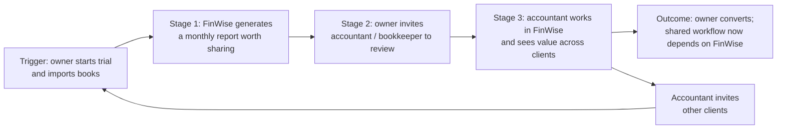

# The Bet · FinWise

> Module 1 · Ignite a PLG Motion. The growth hypothesis and where you're betting, plus the growth-loop visualization.

## Growth hypothesis

**Problem.** 98% of FinWise trials end without a purchase, and that rate does not respond to anything we change upstream.

**Formalized hypothesis.**
- **IF** trial users who finish their data import are prompted to invite their accountant or bookkeeper to review an auto-generated monthly report
- **THEN** trial → paid conversion WILL increase from 2.0% to 2.5% (+25% relative)
- **BECAUSE** a solo user can set FinWise up without ever producing an outcome another person relies on. Once an accountant works from FinWise's report, leaving the product has a cost.
- **MEASURED WITH** an A/B test on new trials, enrolling for 4 weeks and reading each trial at day 14. Primary metric: trial → paid. Secondary: invites sent per trial. Guardrail: data-import completion rate.

### How I got here

**First hunch (scenario only, before the data).** The biggest problem is activation. Trial users never reach a moment where the product proves its value, so paid acquisition fills a bucket with a hole in it. Evidence:
1. Only 2% of trials convert, even though the reverse trial gives full access. Access is not the barrier. Value is.
2. 60% of paying customers churn within a year. Even converted users don't find lasting value.
3. More ad spend no longer moves growth. The constraint sits after sign-up.

My first bet was "get users to import their data on day 1."

**What the data showed (Oct 2023 – Oct 2024).**

| Stage | 13-month total | Step conversion |
|---|---|---|
| Website visits | 94,558 | — |
| Trials started | 6,424 | 6.8% of visits |
| Paid | 128 | 2.0% of trials |

1. **Trial → paid is flat.** It stays between 1.87% and 2.08% in all 13 months. Visits swing 3.4x and trial volume swings 2x, but conversion does not move.
2. **Feature adoption rose; conversion didn't.** Data Import went from ~31% (Jan–Mar 2024) to ~45% (Jul–Sep 2024). Modeling went from 11% (Nov 2023) to 58% (Apr and Sep 2024). Correlation with trial → paid: import −0.05, modeling +0.24.
3. **Session length and frequency move in opposite directions** (r = −0.81). Long-session months (12–14 min, 3–6 sessions/user) alternate with short, frequent ones (5–9 min, 7–9 sessions/user).

**Biggest drop-off:** trial → paid. Funnel stage: **Activation.**

**Confirmed or challenged?** Both. The drop-off is at activation, as I guessed. But pattern 2 breaks my first bet: more users importing data did not lift conversion. Getting data in is not the Aha moment. The gap is between *setup* and *a result someone acts on*.

*Data notes:* revenue equals paid × $78,125 every month ($10M ARR ÷ 128), so it carries no separate signal. "Churned (1yr)" exceeds each month's new paid customers by 1.2–3.5x, so it counts the whole base, not a cohort. I did not use either column as evidence.

## The bet

**Focus: a Collaboration loop at the end of activation.** Small-business finance is shared work between the owner, a bookkeeper, and an accountant. A user who brings their accountant in gains a reason to stay. The accountant becomes a new FinWise user at zero ad cost. Referral loops ask users for a favour. Collaboration loops make inviting part of the job.

**What we're deliberately NOT doing.**
- Not raising paid acquisition or optimizing visit → trial. At a fixed 2% conversion, more trials just scale the leak.
- Not pushing more feature adoption (import, modeling) as the goal. The data says it doesn't move conversion on its own.
- Not building a referral-reward program yet. Incentives without a working Aha moment buy sign-ups that churn.

**Biggest risk to this bet.** Many FinWise users may be solo owners with no outside accountant. If so, the invite step has no one to go to. Next check: the share of trial accounts with an accountant or bookkeeper.

## Growth loop

1. **Trigger:** a business owner starts a trial and imports their books.
2. **Stage 1:** FinWise generates a report worth sharing (monthly P&L, cash-flow forecast).
3. **Stage 2:** the owner invites their accountant or bookkeeper to review it.
4. **Stage 3:** the accountant works inside FinWise and sees value across their client list.
5. **Outcome:** the owner converts because their workflow depends on the shared space. The accountant brings in other clients, restarting the loop with a bigger base and no ad spend.
