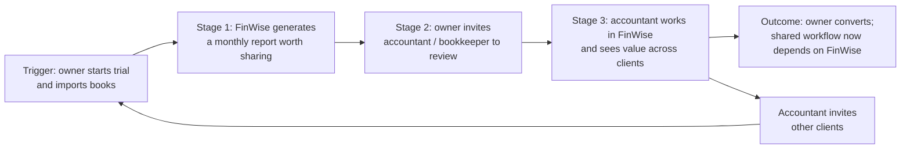

# The Bet · FinWise

> Module 1 · Ignite a PLG Motion. The growth hypothesis and where you're betting, plus the growth-loop visualization.

## Growth hypothesis

**Problem.** 98% of FinWise trials end without a purchase. In the data we have, that rate holds at about 2% whatever happens to traffic or feature adoption.

**Formalized hypothesis.**
- **IF** trial users who finish their data import are prompted to invite their accountant or bookkeeper to review an auto-generated monthly report
- **THEN** the share of trials with an accepted accountant invite WILL increase from ~5% to 10%, and trial → paid WILL follow, from 2.0% toward 2.5%
- **BECAUSE** a solo user can set FinWise up without ever producing an outcome another person relies on. Once an accountant works from FinWise's report, leaving the product has a cost.
- **MEASURED WITH** an A/B test on new trials, enrolling ~870 trials (≈ 8 weeks at FinWise's ~494 trials/month), read at trial end.
  - **Primary (decision) metric:** % of trials with ≥1 accepted accountant invite. Sized to detect 5% → 10% at 95% confidence and 80% power (~434 trials per arm).
  - **Lagging metric (tracked, not decided on):** trial → paid.
  - **Loop metrics:** invites sent per trial, invite acceptance rate, and new trials started by invited accountants (the loop's k-factor).
  - **Guardrail:** data-import completion rate.

> **Known weakness: why trial → paid is not the primary metric.** Detecting 2.0% → 2.5% needs ~13,800 trials per arm, about 56 months of FinWise traffic. Even 2.0% → 3.0% needs ~15 months. A test that can't reach significance can't inform a decision. So I decide on a leading metric with a higher base rate and check that it predicts conversion. Two open assumptions: the ~5% baseline invite rate is a guess to be measured, and the link from accepted invites to conversion must be validated with user-level data (Module 4). If neither holds, Module 5 picks a non-A/B method.

### How I got here

**First hunch (scenario only, before the data).** I think FinWise's biggest problem is that people try the product and never see it do anything for their business. Ads are buying sign-ups for a product that isn't closing them.

Why I think that:
1. It's a reverse trial. People get the full product for free and 98% still walk away. They aren't blocked from the value. They just never reach it.
2. Six in ten paying customers leave within a year. So even the ones who pay aren't getting enough to stay. That's the same problem, showing up later.
3. More ad money stopped working. If the leak were at the top, more money would help. It doesn't, so the leak is after sign-up.

I run small businesses. A finance tool shows me nothing until it has my real numbers in it. So my first bet was simple: get people to connect their books on day one.

**What the data showed (Oct 2023 – Oct 2024).**

| Stage | 13-month total | Step conversion |
|---|---|---|
| Website visits | 94,558 | — |
| Trials started | 6,424 | 6.8% of visits |
| Paid | 128 | 2.0% of trials |

1. **Trial → paid is flat.** It stays between 1.87% and 2.08% in all 13 months. Visits swing 3.4x and trial volume swings 2x, but conversion does not move. *Caveat:* paid equals round(trials × 2%) in every row, so this flatness is built into the case data. It describes the scenario, not observed user behavior.
2. **Feature adoption rose; conversion didn't.** Data Import went from ~31% (Jan–Mar 2024) to ~45% (Jul–Sep 2024). Modeling went from 11% (Nov 2023) to 58% (Apr and Sep 2024). Correlation with trial → paid across the 13 months: import −0.05, modeling +0.24. These are monthly averages, so they say nothing about whether *individual* users who import convert more.
3. **Session length and frequency move in opposite directions** (r = −0.81). Long-session months (12–14 min, 3–6 sessions/user) alternate with short, frequent ones (5–9 min, 7–9 sessions/user).

**Biggest drop-off:** trial → paid. Funnel stage: **Activation.**

**Confirmed or challenged?** Both. The drop-off is at activation, as I guessed. Pattern 2 weakens my first bet: when the share of users importing data rose, overall conversion did not. That doesn't prove import is irrelevant; monthly totals can't show what each user did. It does mean "get users to import" lacks support in this data. So I moved the bet one step later: from *setting up* to *producing a result someone else relies on*. Module 4's user-level data should confirm or kill that.

*Data notes:* revenue equals paid × $78,125 every month ($10M ARR ÷ 128), so it carries no separate signal. "Churned (1yr)" exceeds each month's new paid customers by 1.2–3.5x, so it counts the whole base, not a cohort. I did not use either column as evidence.

## The bet

**Focus: a collaboration-to-referral hybrid loop at the end of activation.** Small-business finance is shared work between the owner, a bookkeeper, and an accountant. A user who brings their accountant in gains a reason to stay. That first step is Collaboration: the owner invites someone to do shared work. The accountant sits outside the company and serves many clients, so the loop's second step works like Referral: the accountant brings other businesses in. Plain referral loops ask users for a favour. This one makes the invite part of the job.

**Why conversion before churn.** I'm treating 2% conversion and 60% churn as one problem, not two. Both come from users never reaching a result they depend on. Today some users pay before they get there, and those are the ones likely to leave. If the trial gets them to a shared, relied-on report first, we should convert more people *and* convert better people. A retention-first plan would polish the experience for 128 new customers a year while the trial keeps failing 6,300 others.

**How I'll know it helps retention, not just conversion.** Secondary metric: 90-day paid retention, treatment vs control. Honest limit: at ~10 conversions per test the retention read is directional only. So I'll also track a leading signal: % of new paid accounts with an active outside collaborator at day 30. If the bet works, that number goes up and churn among those accounts goes down over the following two quarters.

**What we're deliberately NOT doing.**
- Not raising paid acquisition or optimizing visit → trial. At a fixed 2% conversion, more trials just scale the leak.
- Not pushing more feature adoption (import, modeling) as the goal. The data says it doesn't move conversion on its own.
- Not running churn-only plays yet (win-back offers, annual-plan discounts). They treat the symptom. Module 3 covers engagement and retention mechanics; I'll revisit there.
- Not building a referral-reward program yet. Incentives without a working Aha moment buy sign-ups that churn.

**Biggest risk to this bet.** Many FinWise users may be solo owners with no outside accountant. If so, the invite step has no one to go to. Next check: the share of trial accounts with an accountant or bookkeeper.

## Growth loop

1. **Trigger:** a business owner starts a trial and imports their books.
2. **Stage 1:** FinWise generates a report worth sharing (monthly P&L, cash-flow forecast).
3. **Stage 2:** the owner invites their accountant or bookkeeper to review it.
4. **Stage 3:** the accountant works inside FinWise and sees value across their client list.
5. **Outcome:** the owner converts because their workflow depends on the shared space. The accountant brings in other clients, restarting the loop with a bigger base and no ad spend.
