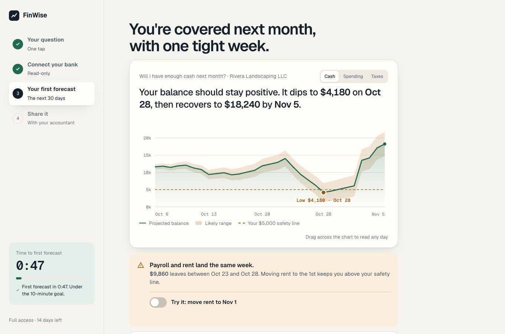

# The Solution · FinWise

> Module 2 · Acquisition & Activation. The onboarding solution and the Aha moment that makes value land.

## Aha moment

In their first session, the owner imports their bank data and sees FinWise's first modeling output: a 30-day cash forecast built from their own numbers, showing the week cash gets tight and what to do about it. The realization: "I know whether I'll have enough cash next month, and I didn't have to build anything to find out." Measured as: a forecast viewed from imported data within 10 minutes of sign-up.

_____

## Onboarding prototype

[Prototype link](https://mdorticos16x9.github.io/finwise-strategy/02-solution/prototype/)

_____

## Why this activates

This works because the user sees their own numbers projected forward on screen 3, before FinWise asks them to configure or invite anything. The friction I removed was manual set-up before value: one bank connection replaces CSV import, category mapping and a chart of accounts, and I cut the business-type question because it didn't change the first answer. That matters because more users importing data didn't lift conversion in the Module 1 data; the payoff is the modeling output, and Modeling is the only usage signal that rises with trial-to-paid. The Aha occurs on screen 3, the first time the owner sees the week their cash gets tight and what to fix. A one-question quiz on screen 1 picks which answer leads, and the accountant invite comes only after the Aha, so it shares value instead of asking for a favor.

_____
