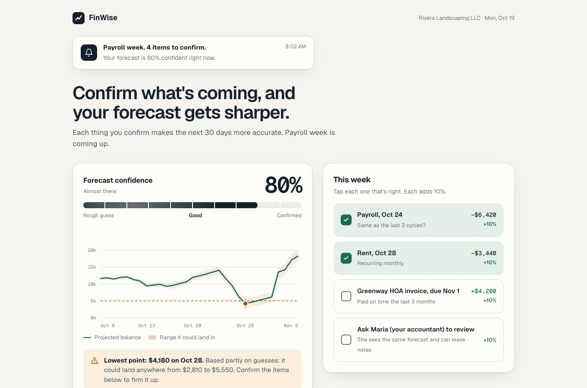

# The Mechanic · FinWise

> Module 3 · Retention & Engagement. The engagement mechanic that builds the habit loop, with rationale and a wireframe.

## The mechanic

**Mechanic:** Progress Bar

- **Trigger:** Monday morning, before payroll week: a short note that says how many items need confirming and how confident the forecast is (e.g. 4 items, 60% confident). Over time the owner's own worry about cash replaces the note.
- **Action:** The weekly cash check: opening the 30-day forecast and confirming what's coming in and out (payroll, rent, expected invoices) so the forecast stays right.
- **Reward:** The confidence bar fills and the lowest point firms up. The variable part: some weeks the tight spot disappears, some weeks a new risk gets caught early.
- **Investment:** Every confirmed bill, invoice pattern and accountant note makes next week's forecast more accurate and pre-fills next week's list, so the product gets more valuable the more the owner puts in.

_____

## Rationale

This addresses value churn. In the months when modeling usage was highest, sessions were shortest (7.8 vs 12.2 minutes) and churn was highest (34 vs 21 a month): users open the forecast, glance, and leave without making it theirs. The progress bar rewards depth, confirming what's coming, not visits. A user about to churn would stay because the forecast becomes something they built, trust, and share with their accountant, and in a reverse trial that's exactly what they lose at downgrade. I decided against a streak because it rewards the quick glances linked to churn, and against a leaderboard because cash positions are private.

_____

## Wireframe

[Wireframe link](https://mdorticos16x9.github.io/finwise-strategy/03-mechanic/wireframe/)

_____
